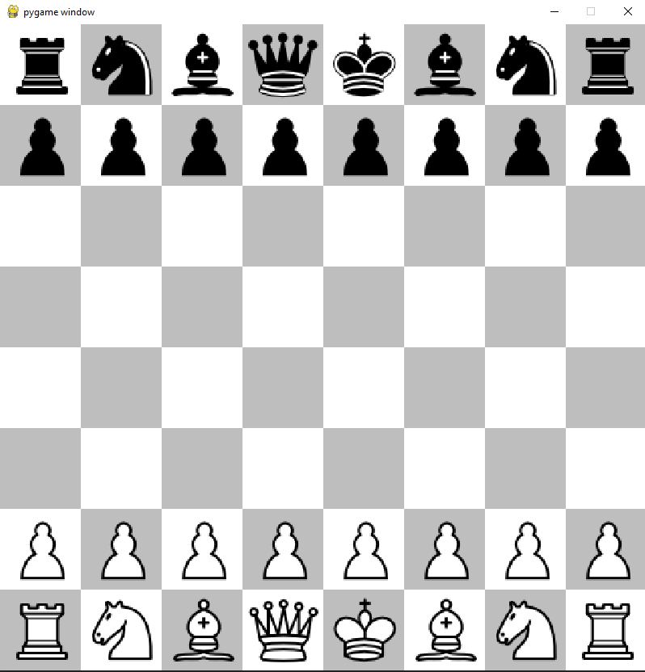

## Chess python
Play your favorite game... chess... in python!

## Tech stack
````
^python3.8 | pygame
````

## Install
```
python3 -m pip install -r requirements.txt
```

## How to play
```
python3 -m chess
```

<br/>


